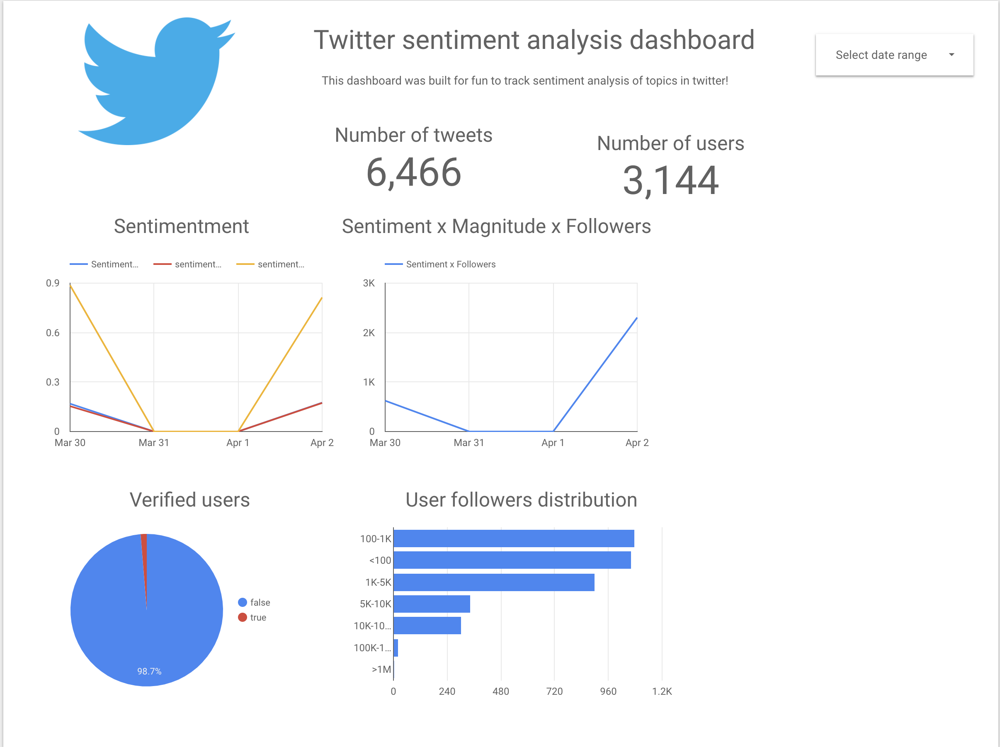
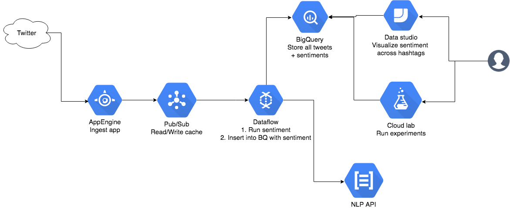

# Twitter sentiment on GCP using dataflow

This is a project made for fun to see how hard it would be to analyze tweets in real time for a collection of hashtags. I made this to monitor crypto tweets! (but can obviously be used for anything)

## Result

This is just a simple dashboard to illustrate results.

## Architecture

This project uses:
* App engine to ingest tweets
* Dataflow to process
* Pub/Sub to connect the dots
* Bigquery for storage/warehousing
* NLP API for sentiment analysis
* Data studio for visual analysis

## Requirements

* [gcloud cli](https://cloud.google.com/sdk/gcloud/)
* [envsubst/gettext](https://www.gnu.org/software/gettext/manual/html_node/envsubst-Invocation.html)
* [terraform](https://www.terraform.io)

## License
MIT